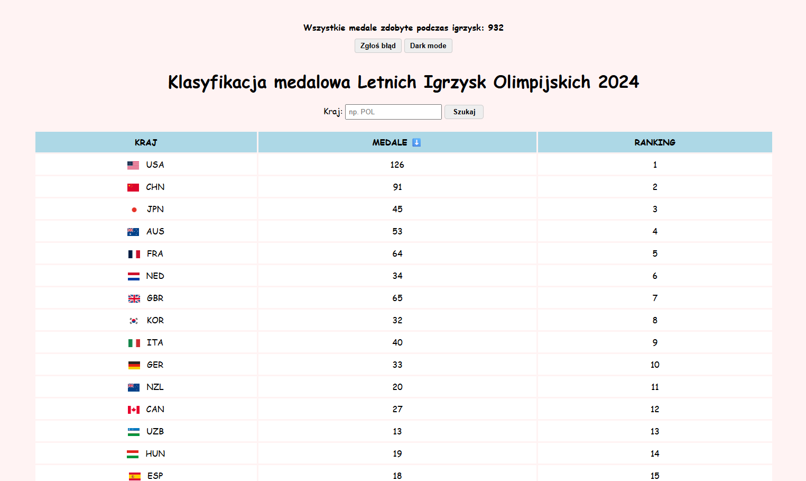
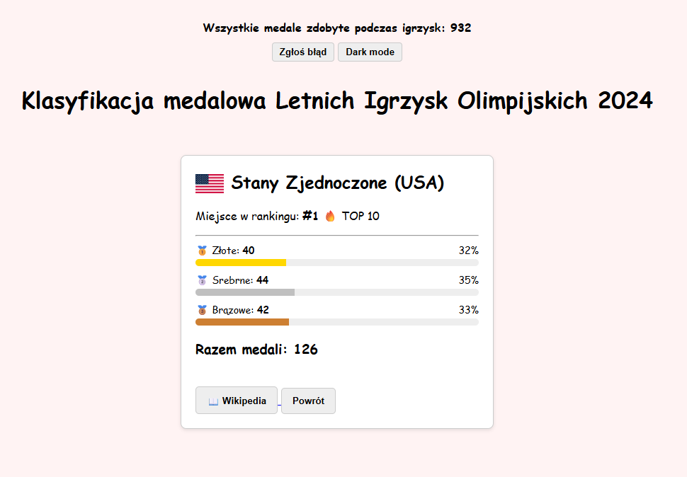
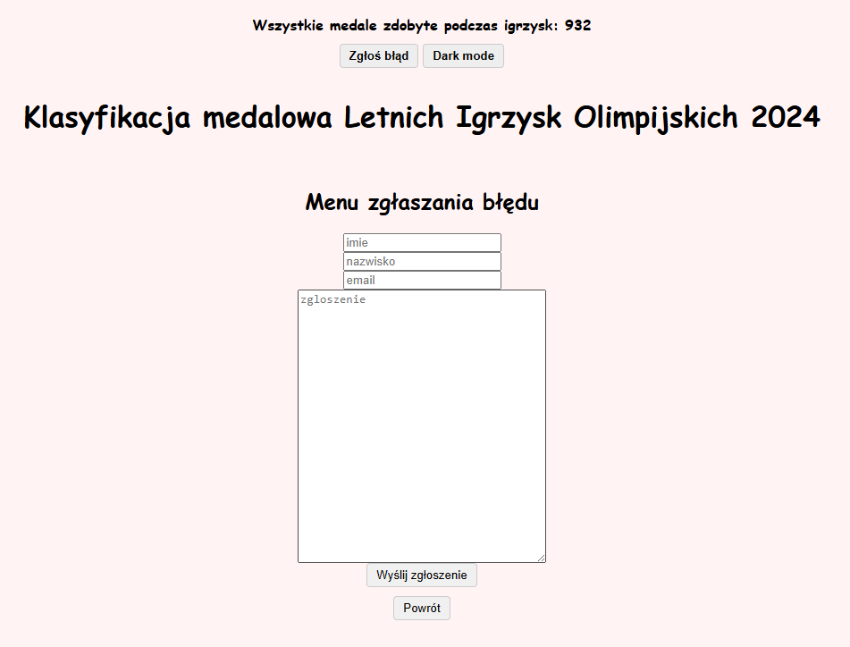

# Klasyfikacja Medalowa Letnich Igrzysk Olimpijskich 2024

## Skład zespołu:
* Piotr Strojny
* Miłosz Soliwoda
* Sebastian Wendelewski

---

## 1. Opis projektu
Aplikacja jest interaktywnym panelem prezentującym rankingi medalowe krajów uczestniczących w Letnich Igrzyskach Olimpijskich 2024. Tematem projektu są Sport oraz Dane statystyczne. Dane są pobierane w czasie rzeczywistym z zewnętrznego API. 

Aplikacja została wykonana w czystej technologii JavaScript (ES6+), HTML5 oraz CSS3 – całkowicie bez użycia frameworków. Całość została zaprojektowana zgodnie z architekturą modułową i responsywnością Mobile-First.

---

## 2. Realizacja Kryteriów Oceny Projektu

### I. Wymagania minimalne (MVP)
* **Minimum 3 widoki:** Aplikacja obsługuje trzy niezależne stany interfejsu:
  1. Lista danych: Widok główny z tabelą klasyfikacji medalowej.
  

  
  

  2. Szczegóły elementu: Karta szczegółowa konkretnego kraju (wywoływana kliknięciem w wiersz tabeli).
  

  
  

  3. Formularz: Widok dynamicznego formularza zgłaszania błędów.
  

  
  

* **Komunikacja z API (Jedno źródło danych, fetch):** Zapytania asynchroniczne (async/await) skierowane są do zewnętrznego punktu końcowego: https://apis.codante.io/olympic-games/countries.
* **Dynamiczne renderowanie danych:** Tabela wynikowa oraz karta szczegółów są generowane automatycznie po pomyślnym przetworzeniu odpowiedzi z API.
* **Podstawowa obsługa błędów:** Bezpieczeństwo zapewnia konstrukcja try...catch. W przypadku awarii serwera lub braku sieci, użytkownik zamiast pustej strony widzi czytelny komunikat błędu.
* **Podstawowa walidacja formularza:** Wyszukiwarka przed przetworzeniem zapytania sprawdza warunek trim(). Jeśli pole jest puste, użytkownik zostaje powiadomiony o konieczności wpisania nazwy.
* **Responsywny layout (Mobile-First):** Style bazowe (w pliku css.css) napisane są pod małe ekrany, a rozszerzenia dla desktopów ładowane są przez Media Queries (min-width: 768px). Kontener tabeli zabezpieczono właściwością overflow-x: auto.

### II. Rozszerzenia funkcjonalności
1. **Sortowanie danych:** Możliwość sortowania krajów według liczby medali (malejąco i rosnąco) z dynamiczną, wizualną zmianą ikony strzałki w nagłówku kolumny.
2. **Filtrowanie:** Wyszukiwarka pozwala na filtrowanie wyników w czasie rzeczywistym po kodzie lub nazwie kraju przy użyciu metod filter() oraz includes().
3. **Zapis danych w localStorage (Dark Mode):** System zapamiętuje preferencje motywu kolorystycznego użytkownika. Wybór trybu ciemnego jest trwały i nie resetuje się po odświeżeniu strony.
4. **Przetwarzanie danych (Agregacje, statystyki):** Aplikacja wykorzystuje metodę reduce(), która agreguje dane z API, oblicza globalną sumę wszystkich zdobytych medali na igrzyskach i wyświetla ten wynik w nagłówku. Dodatkowo w szczegółach obliczany jest procentowy udział konkretnych medali w dorobku kraju.
5. **Więcej niż jedno zapytanie / Integracja zewnętrzna:** Widok szczegółowy generuje dynamiczny link i przenosi użytkownika bezpośrednio do powiązanego tematycznie artykułu w polskim serwisie Wikipedia.

### III. Jakość projektu i UX
* **Czytelność i modularność kodu:** Kod został podzielony na wyspecjalizowane moduły JS (slownik.js, szczegoly.js, tabela.js, zgreszenia.js, darkmode.js, app.js), co zapewnia idealną organizację i separację logiczną.
* **Zarządzanie stanem i zaawansowana obsługa błędów:** Aplikacja posiada globalną tablicę wszystkieDane, która przechowuje pobrany z API stan, eliminując potrzebę ponownego odpytywania serwera przy filtrowaniu i sortowaniu.
* **UX i efekty wizualne:** W widoku szczegółowym zastosowano paski postępu CSS, które graficznie obrazują rozkład medali. Kraje z pierwszej dziesiątki rankingu są wyróżniane specjalną ikoną (TOP 10). Przełączanie w tryb Dark Mode odbywa się za pomocą płynnych przejść tonalnych.

---

## 3. Struktura plików projektu
* index.html – Struktura bazowa dokumentu i import skryptów.
* css.css – Style graficzne (Mobile-First, ekrany desktopowe oraz adaptacja do ekranów wysokiej rozdzielczości).
* slownik.js – Baza mapowania kodów ISO na język polski.
* szczegoly.js – Logika widoku karty szczegółowej, paski postępu, linki Wikipedii.
* tabela.js – Logika renderowania wierszy, filtrowanie oraz algorytm sortowania.
* zgloszenia.js – Dynamiczny generator widoku formularza zgłoszeniowego (podmiana widoku w DOM).
* darkmode.js – Obsługa trybu nocnego i komunikacja z localStorage.
* app.js – Inicjalizacja szkieletu, asynchroniczne pobranie danych z API i zarządzanie zdarzeniami globalnymi.

---

## 4. Instrukcja obsługi

1. **Start:** Po wejściu na stronę dane ładują się automatycznie z API, a na górze pojawia się wyliczony globalny licznik medali.
2. **Szukanie:** Wpisz kod/nazwę w wyszukiwarce i kliknij "Szukaj". Czyste pole przywraca całą tabelę.
3. **Sortowanie:** Kliknięcie w nagłówek kolumny "MEDALE" przełącza porządek tabeli.
4. **Szczegóły:** Kliknięcie w dowolny wiersz kraju otwiera kartę z wykresami i linkiem do Wikipedii. Przycisk "Powrót" zamyka kartę.
5. **Formularz:** Przycisk "Zgłoś błąd" bezpiecznie ukrywa interfejs danych i otwiera formularz kontaktowy.
6. **Dark Mode:** Przycisk w nagłówku natychmiastowo zmienia motyw kolorystyczny strony.
